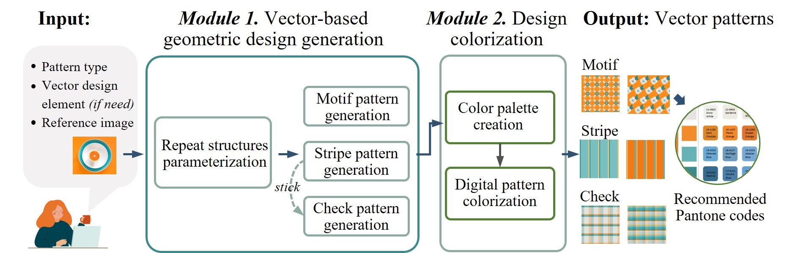

# Automatic_Vector_Pattern_Generation
This repository contains code and materials for the paper _Color, layout, and fashion: generating aesthetically pleasing vector patterns for fashion design,_ contributed by Hong Qu, K. P. Chau, and P. Y. Mok*. All rights reserved by authors.

-----
## Introduction
In response to the growing demand for new and exciting fashion products, including decorative patterns, designers are under immense pressure to produce hundreds of patterns within days. While vector patterns are a commonly used format for decorative patterns due to their ease of editing and reusability, developing new vector patterns from scratch is often tedious and time-consuming, despite the widespread use of computer-aided design (CAD) software in the industry. Currently, there is limited research on automatic vector pattern generation. To address this gap and improve the situation, this study proposes an automatic system for generating fashion-used vector patterns based on existing design rules. The system focuses on three common types of patterns, namely stripe, check, and motif patterns, which are parametrically modeled to automate the design process. The proposed system generates patterns from both vector-based geometric design generation and design colorization perspectives. Implementation experiments demonstrate that the design outputs meet basic human aesthetic criteria and that the system can support design work.

